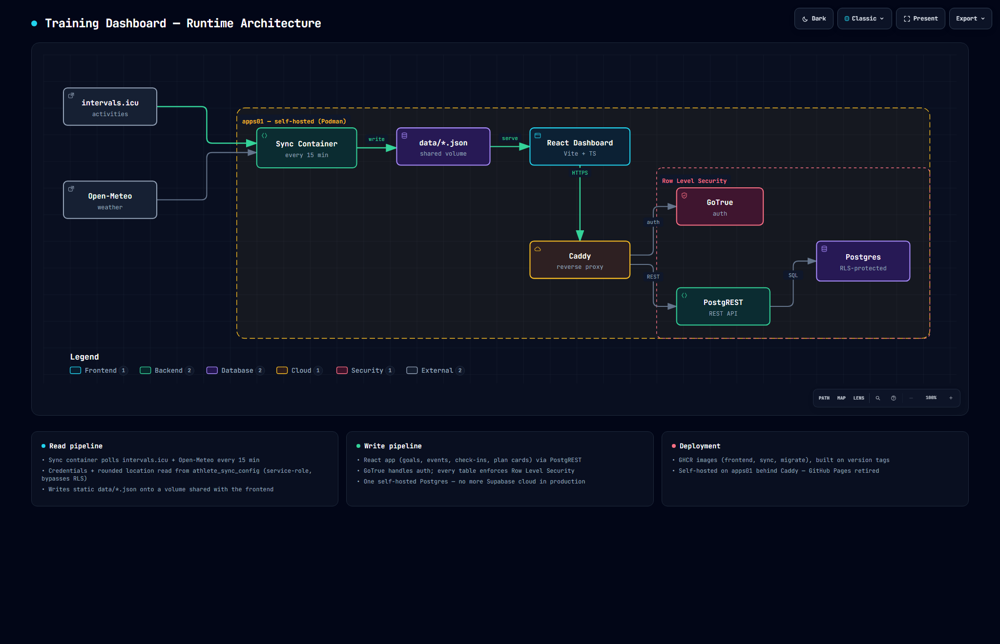

# 📊 Trainingsdashboard

Selbst-gehostetes Trainingsdashboard für Rad, Lauf und Schwimmen mit zwei Datenpfaden: **Lesedaten** (Leistungs-, HRV-, Schlaf- und Wellness-Werte aus intervals.icu und Open-Meteo) werden **alle 15 Minuten** von einem Sync-Container synchronisiert und als statisches JSON ausgeliefert. **Schreibdaten** (Login, Ziele, Events, tägliches Befinden, Trainingskarten, Trainer-Vorschläge, Admin-Nutzerverwaltung) laufen über eine selbst gehostete Postgres/GoTrue/PostgREST-Instanz mit Row Level Security und machen aus dem ursprünglich rein statischen Dashboard eine interaktive Mehrbenutzer-App mit Athlet-, Trainer- und Admin-Rolle. Betrieb: selbst-gehostet als Container-Verbund (Podman in Produktion) auf einem eigenen Server hinter Caddy — kein GitHub Pages, keine Cloud-Abhängigkeit für Schreibdaten mehr.

**Vier Athleten, unterschiedlich weit ausgebaut:**
- **Athlet 1** — Primärnutzer, eigener Trainingsplan (Rad). Trainingshistorie seit März 2026, FTP 166 W → 193 W → laufendes Ziel ≥ 210 W (pyramidale Periodisierung, Retest 19.09.2026). Die frühen Wochen (März–Juni) sind eine eingefrorene Historie im Code, keine Live-Datenquelle mehr.
- **Athlet 2** — Vergleichsathlet, eigener Renn-Trainingsplan (GFNY Bremen 2026, Renntag war der 30.08.2026), read-only im Planungstab.
- **Athlet 3** — Triathlet: einziger Athlet mit mehreren Sportarten (Rad **und** Lauf **und** Schwimmen), sportartübergreifende CTL/ATL/TSB, eigene Pace-Zonen/-Kurve fürs Laufen, editierbarer Laufplan.
- **Athlet 4** — Renn-/Trainings-Einsteiger, generierte 12-Wochen-Einsteigervorlage für Zwift/MyWhoosh (`.zwo`-Export), noch ohne gemessene FTP.

🔗 **Live:** [training-dashboard.clear-solutions-it.com](https://training-dashboard.clear-solutions-it.com)
📁 **QA-Portfolio:** [github.com/Stuhlsen/Portfolio](https://github.com/Stuhlsen/Portfolio)

---

## Architektur



`data/subjective.json` und `data/adjustments*.json` sind seit der Migration nach `plan_cards` bzw. dem täglichen Supabase-Check-in nur noch read-only Archiv älterer Daten, kein aktiver Schreibpfad mehr. `data/*.json` selbst ist nicht mehr versioniert — der Sync-Container schreibt direkt in ein mit dem Frontend geteiltes Volume.

**Tech-Stack:** React + TypeScript + Vite (`/app/`, SVG-Charts als React-Komponenten) · Node.js ≥ 24 lokal (Details/Begründung in `AGENTS.md`) · Daten-Sync alle 15 Minuten als Dauer-Container auf dem Produktivserver (nicht mehr GitHub Actions) · GitHub Actions nur noch CI (getrennte Jobs für Root und `/app/`: Tests, ESLint, Fallow-Report) + GHCR-Image-Publish bei `v*`-Tag · Postgres + GoTrue + PostgREST mit Row Level Security (`@supabase/supabase-js`-npm-Paket als Client, kein Supabase-Cloud-Projekt mehr in Produktion)

**Code-Architektur:** strikte Schichtentrennung `app/src/core/` (reine, getestete Berechnung — PMC, Belastungswächter, Readiness, Belastungsempfehlung, Intensitätsverteilung, EF-/HF-Decoupling-Trend, FTP-Prognose, Regeneration & Körper, Periodisierung, Konsistenz & Adhärenz, Bestwerte, Plan-Konflikte/-Prognose, Vorschlags-Validierung) → `app/src/api/` (I/O-Grenze: JSON-Pipeline + Supabase-Adapter) → `app/src/hooks/`/`features/` (Orchestrierung, React Query) → `app/src/components/`/`charts/`/`features/*` (Rendering). `app/src/sports/` kapselt austauschbare Zonen-/Metrik-Logik je Sportart (bisher `cycling`, `running`, `swimming` befüllt). Der Daten-Sync ist analog in `scripts/lib/`-Module zerlegt. Design: Konzept 5 — Glas-Kacheln auf Anthrazit-Blau, die Trainingszonen-Skala als Farbsystem, Sora/IBM Plex Mono/Inter.

---

## Features

### Login, Rollen & Athleten-Toggle

Vier Rollen: **Athlet** (eigener Login, schreibt eigene Ziele/Events/Befinden/Trainingskarten), **Trainer** (eigener Login, sieht „seinen" Athleten vollständig, kann direkt ändern oder als Vorschlag markieren), **Admin** (verwaltet Nutzer — einladen, sperren/entsperren, löschen, Zugangslink erneut senden, mit Audit-Log) und **Besucher** (kein Login, liest öffentliche Daten). Login/Registrierung laufen über eine geführte Onboarding-Strecke (Einladungslink → Passwort setzen → Profil-Basisdaten wie Wohnort per Stadt-Suche statt roher Koordinaten, Geburtsdatum, Ruhepuls). Der Athleten-Toggle oben rechts im Header bleibt für Besucher frei wählbar und wechselt Charts, Texte und Erklärtexte auf den jeweils aktiven Athleten, unabhängig davon, wer eingeloggt ist — Schreibaktionen bleiben dabei immer an die tatsächliche Beziehung gebunden (Selbst/Trainer/Admin), ein fremder Betrachter sieht nur lesend zu. Die Auswahl bleibt persistent über Reload (`localStorage`).

Athlet 2 bleibt read-only im Planungstab: kein Anlegen/Verschieben/Ausfallen von Karten, kein Workout-Push, keine Befinden-Spalte im Fahrtenbuch. Typ-Inferenz läuft dort weiter über IF-Berechnung (NP ÷ FTP) + Fahrtdauer statt über Planzuordnung.

### Tab: Übersicht
- Hero mit **FTP-Zonen-Band** (Watt-Skala mit Pins für FTP, eFTP und Saisonziel), **FTP-Fortschrittsring** und **Session-Pill** (nächste geplante Einheit, berücksichtigt Verschiebungen/Ausfälle, zeigt Renn-Countdown bei anstehenden Events)
- **Tagesform-Ampel**: HRV (SDNN), Ruhepuls und Schlaf der letzten 7 Tage gegen eine rollierende 42-Tage-Baseline — mit konkreter Trainingsempfehlung (wie geplant / Intensität reduzieren / Erholung), zusätzlich durch das tägliche Morgen-Check-in-Befinden geschärft. Grundlage: HRV-gesteuertes Training (u. a. Javaloyes 2019)
- **Wochenrückblick**: die letzte abgeschlossene Woche als Karte — Umfang, stärkste Einheit, Wetter-Highlight, Plan-Erfüllung
- KPIs: Gesamtdistanz (nur getrackte Fahrten), FTP, Fahrtenanzahl, Trainingszeit
- **Konsistenz-Jahreskalender** (GitHub-Stil): jeder Trainingstag als Zelle, gefärbt nach Tageslast; die Zeilenzähler übernehmen die Wochentagsverteilung
- **Bestwerte-Wand**: automatisch erkannte persönliche Bestleistungen (längste Fahrt/Fahrzeit, beste NP ≥ 20 min, schnellste 40 km+, meiste Höhenmeter, größte Woche) — jeweils mit Ablöse-Historie
- **Event-Timeline**: anstehende Rennen/Touren mit Datum, Priorität und Countdown (Athlet legt Events selbst über das Einstellungsmenü an)

Für Athlet 3 (Triathlet) zeigt der Tab zusätzlich eine sportartübergreifende CTL/ATL/TSB-Anzeige und einen Sport-Umschalter zwischen Rad, Lauf und Schwimmen mit jeweils eigener Zonen-/Pace-Darstellung.

### Tab: Fahrtenbuch
Sortier- und filterbare Tabelle aller Fahrten. Fahrten am selben Tag werden nach Startzeitpunkt sortiert. Ein 📅-Icon springt zur zugehörigen Plankarte im Planungstab. Wetter-Spalte mit Ampel-Farbcodierung und Hover-Tooltip.

### Morgen-Check-in, Ziele & Events

- **Morgen-Check-in**: tägliches Dialog mit 3–4 Reglern (Schlaf, Energie, Muskelgefühl, Stimmung) + optionaler Notiz, liefert auch an Ruhetagen einen Datenpunkt. Fließt in die Belastungsempfehlung ein (ein rotes Erholungssignal aus dem Check-in kann einen grünen TSB überstimmen) und ist per `wellbeing_public`-Schalter im Profil optional für den Trainer sichtbar (die Notiz bleibt immer privat, nur der Slider-Wert kann geteilt werden).
- **Ziele**: frei definierbare, aktive Ziele im Einstellungsmenü, athletenbezogen.
- **FTP-Historie**: eigene Einträge zusätzlich zur automatisch aus intervals.icu gezogenen eFTP-Kurve, für den FTP-Dreiklang im Analyse-Tab.
- **Events**: Rennen/Touren mit Datum und Priorität, verknüpft mit der Session-Karte (Countdown) und der FTP-Zielplanung.

### Tab: Planung — interaktiver Wochenplaner

Trainingskarten leben in einer RLS-geschützten Tabelle, nicht mehr in JSON. Sessions werden automatisch als „erledigt" markiert, sobald eine passende intervals.icu-Fahrt gefunden wird — mit Soll-Ist-Vergleich (Distanz, Watt, HF, Kadenz, Dauer, TRIMP/CTL, Wetter, Befinden). Bidirektionale Verlinkung mit dem Fahrtenbuch.

- **Karten-CRUD**: Anlegen/Bearbeiten/Löschen inkl. wiederholbarer Workout-Blöcke über einen Dialog. Bei Athlet 3 zusätzlich Sportartauswahl (Rad/Lauf/Schwimm) mit abhängigen Zielgrößen (Watt vs. Pace).
- **Drag & Drop** ohne Framework (reine Pointer Events): Karte auf einen anderen Tag ziehen, mit Kanten-Autoscroll; Verschieben in die Vergangenheit wird abgewiesen.
- **Prognose & Konflikterkennung**: jede Verschiebung/Änderung rechnet die PMC-Fortschreibung neu und prüft ein festes Regelset (TSB-Einbruch, harte Tage in Folge, Ramp-Rate, Event-Nähe, Terminüberlappung, sportartübergreifend bei Athlet 3) — warnt, blockiert aber nicht. Nach jeder Aktion zeigt ein Delta-Banner die TSB-Änderung, Konflikt-Badges hängen direkt an der Karte.
- **Workout-Push zu intervals.icu**: strukturierte Workouts per Knopfdruck pushen, per `external_id`-Upsert dedupliziert (erneutes Pushen derselben Karte überschreibt statt zu duplizieren) — nur für den eigenen Athleten. Athlet 4 kann Karten stattdessen als `.zwo`-Datei für Zwift/MyWhoosh exportieren.
- **Ruhetage** sind abgeleitet, keine eigenen Karten: ein Tag ohne Trainings-Slot und ohne aktive Karte im Plan-Wochen-Modell zählt automatisch als Ruhetag und nie als „verpasst".
- **Athlet 2** (GFNY Bremen 2026, eigener Namensraum) bleibt read-only, keine der obigen Schreibaktionen verfügbar.

### Trainer-Dashboard & Claude-Trainer-Workflow

Loggt sich ein Trainer ein, erscheint eine Trainer-Leiste über dem Dashboard „seines" Athleten (frei konfigurierbare Kennzahlen-Kacheln, Auswahl wird pro Trainer-Athlet-Paar in der Datenbank gemerkt). Der Trainer kann Karten direkt ändern/verschieben oder — beim Anlegen/Löschen zwingend — als **Vorschlag** einreichen. Der Athlet sieht offene Vorschläge als Banner, öffnet eine Vergleichsansicht (alte/neue Karte nebeneinander) und nimmt an oder lehnt ab.

**Claude als Trainer** läuft bewusst ohne API-Anbindung aus der App heraus: ein **Coach-Panel** erzeugt ein Markdown-Briefing (Profil, Events, Plan, Ist-Fahrten, Befinden, Prognose) samt fertigem Prompt zum Kopieren in einen Claude-Pro-Chat, mit Live-Feedback beim Einfügen der Antwort (erkannte/nicht erkannte Vorschläge direkt sichtbar) — Export und Import sind ein einziger, durchgängiger Workflow statt getrennter Dialoge. Eine Richtungsvorgabe (Preset + Freitext + Zielevent) lässt sich mitgeben und wird pro Profil gemerkt. Die Antwort (JSON-Vorschlagsblock) wird validiert (Struktur + Semantik, sammelt alle Fehler statt beim ersten abzubrechen) und landet — mit Teilerfolg bei gemischt gültigen/ungültigen Einträgen — als offene Vorschläge im selben Review-Flow wie menschliche Trainer-Vorschläge. Der komplette Austausch bleibt als Verlauf sichtbar.

### Tab: Analyse — „Antworten & Spuren"

Für alle Athleten verfügbar, per Zeitraum-Brush (Presets 30/90 Tage, „Mit Prognose") einschränkbar:

- **Hero-Urteil**: Tagesform-Kurzfassung mit Kennzahlen-Stats für den gewählten Zeitraum, darunter die Brush-Leiste zum Zeitfenster-Ziehen.
- **„Das läuft"**: Kacheln mit dem, was gerade positiv läuft (nur wenn vorhanden).
- **Vier Leitfragen**, je mit Ampel-Urteil, Kurztext und **Spurenkarte** (mehrere Kennzahlen-„Spuren" synchron über denselben Zeitraum, W/kg-Toggle):
  1. *Werde ich stärker?* — eFTP-Verlauf, Effizienzfaktor
  2. *Verkrafte ich die Last?* — Fitness/CTL, TSB, TSS Ist/Plan, Zonenverteilung
  3. *Wie erhole ich mich?* — HRV, Ruhepuls, Schlaf
  4. *Was bremst mich?* — HF-Decoupling, Kadenz, Energiebilanz, Hydration, Wetter, Gewicht
  Frage 1 zeigt zusätzlich die Power-Curve als eigene Spurenkarte. Für Athlet 3 treten an die Stelle der Watt-Kennzahlen Pace-Äquivalente (Pace-Zonen, Pace-Curve, Pace:HF-Decoupling, geschätzte Schwellenpace).
- **Kennzahlen (eingeklappt)**: Belastung & Erholung (CTL-Ramp, Foster-Monotonie), Intensitätsverteilung (polarisiert/pyramidal/schwellenlastig, 80%-Richtwert), Aerobe Entwicklung (EF, HF-Decoupling, Kadenz), Leistungsdiagnostik (FTP-Dreiklang 🔬 gemessen / 〜 geschätzt / 🎯 Ziel, Bestwerte), Regeneration & Körper (Gewicht, Energiebilanz, Hydration — nur bei ≥ 5 Punkten/30 Tagen), Konsistenz & Adhärenz, Periodisierungs-Erfüllung (nur eigener Plan).

**Wetter:** Standortkoordinaten liegen RLS-geschützt und serverseitig grob gerundet (~1,1 km) in einer eigenen Tabelle — niemals im Code, nie in der JSON, nie im Frontend-JavaScript, jeder Athlet trägt sie über die Onboarding-Strecke bzw. Settings selbst ein. Historisches Wetter, aktuelles Wetter (letzte 3 Tage) und der 16-Tage-Planungs-Forecast werden ausschließlich serverseitig im Sync-Container berechnet. Nur die Wetterwerte landen in `rides.json`, nie die Koordinaten.

### Settings & Admin-Bereich

Selbst-Service für den eigenen Account: Ziele, Profil-Basisdaten (Wohnort per Stadt-Suche, Geburtsdatum, Ruhepuls, Maximalherzfrequenz, Kadenz-Ziel), intervals.icu-Anbindung, Formate-Katalog, Datenexport, Feedback, Konto-Löschung, Zwei-Faktor-Einrichtung. Ist der eingeloggte User Admin, kommt eine **Nutzerverwaltung** dazu: neue Athleten/Trainer per E-Mail einladen (inkl. Rollenwahl), Nutzer sperren/entsperren, hart löschen (mit Bestätigungsschritt), Zugangslink erneut senden — jede Aktion landet in einem Audit-Log.

---

## Datenquellen

### Lesedaten (JSON-Pipeline, alle 15 Minuten)

| Feld | Notion-Ära (eingefroren, kein Live-Zugriff mehr) | intervals.icu-Ära (aktuell) |
|---|---|---|
| Ride-Metriken (Power, HR, TSS …) | Notion (historisch, im Code eingefroren) | intervals.icu API |
| Power Curve | — | intervals.icu `/power-curves` (gesamt + je Trainingsblock) |
| Zone-Times (Zeit in Zonen) | — | intervals.icu (`icu_zone_times`) |
| eFTP-Historie | — | intervals.icu (`icu_eftp` je Fahrt + Wellness `sportInfo`) |
| CTL / ATL / TSB | Notion (historisch) | intervals.icu (automatisch) |
| Wellness (RHF, HRV, Schlaf) | Notion (historisch) | intervals.icu (Apple Health/Amazfit Sync, je Athlet) |
| Wetter | Notion (historisch) | Open-Meteo (automatisch, serverseitig aus gerundeter Standort-Angabe) |
| Geplante Sessions (Ursprung) | eingefroren in `scripts/lib/plan1-history.js` | eigene Plan-Karten-Tabelle (RLS) |

**Typ-Inferenz:** NP ÷ FTP = Intensity Factor (IF). Fahrten unter IF 0,75 werden zusätzlich nach Dauer klassifiziert — ≥120 min = Z2 Lang, ≥60 min = Z2 Dauer, <60 min = Z1 Recovery.

Die frühe Notion-Ära (März–Juni 2026, Athlet 1) ist eine **eingefrorene Historie**: kein Notion-API-Aufruf mehr zur Laufzeit, die Daten liegen fest im Code (`scripts/lib/plan1-history.js`). Alle vier Athleten laufen heute einheitlich auf ISO-Kalenderwochen statt der ursprünglichen Plan-1/Plan-2-Aufteilung.

### Schreibdaten (sofort, RLS-geschützt)

| Bereich | Zweck | Wer schreibt |
|---|---|---|
| Profile | Rolle, Anzeigename, Trainer-Zuordnung, Profil-Basisdaten | Athlet/Trainer (eigenes Profil) |
| Ziele | Freie Ziele | Athlet |
| Events | Rennen/Touren mit Datum, Priorität | Athlet |
| Befinden | Morgen-Check-in (Slider + Notiz) | Athlet |
| Trainingskarten | Plan-Karten je Sportart | Athlet, Trainer (direkt oder als Vorschlag) |
| Vorschläge | Trainer-/Claude-Vorschläge zur Übernahme durch den Athleten | Trainer, Claude-Import (menschlich freigegeben) |
| FTP-Historie | Manuelle FTP-Einträge zusätzlich zur eFTP-Kurve | Athlet |
| Admin-Audit-Log | Wer hat wann welchen Account wie geändert | nur Admin (lesend), `admin-api` (schreibend) |

Alle Tabellen sind per Row Level Security abgesichert (`supabase/migrations/`, im Repo versioniert); anonyme Leser sehen nur, was pro Tabelle explizit freigegeben ist (z. B. Befinden nur bei aktivem Sichtbarkeits-Schalter, nie die Notiz).

---

## Setup

### Voraussetzungen
- GitHub-Account (für Actions/Secrets — kein GitHub Pages nötig, das Frontend läuft selbst-gehostet in Containern, Podman in Produktion)
- intervals.icu Account (Wahoo/Garmin verbunden)
- Node.js ≥ 24 lokal — `npm test` nutzt `--experimental-test-module-mocks` mit der `{ exports }`-Kurzform, die erst ab Node 24 zuverlässig läuft (Details in `AGENTS.md`)
- Ein eigenes Postgres/GoTrue/PostgREST-Setup (lokal per Docker Compose) nur nötig, wer die Schreibfunktionen (Login, Planung, Trainer-Flow, Admin) selbst betreiben will — die reine Leseansicht funktioniert auch ohne

### Sync-Zugangsdaten (Lesedaten-Pipeline)

Der Sync läuft als Dauer-Container auf dem Produktivserver. Er liest alle athletenbezogenen Zugangsdaten (intervals.icu-Key + Athlete-ID, grobe Standortkoordinaten) per **Service-Role** aus einer RLS-geschützten Tabelle — jeder Athlet trägt sie selbst über die Onboarding-Strecke bzw. Settings ein. Der Container braucht damit nur noch:

| Wert | Beschreibung |
|---|---|
| `SUPABASE_URL` | Postgres/PostgREST-Endpunkt |
| `SUPABASE_SERVICE_ROLE_KEY` | einziger Sync-Zugang zu Zugangsdaten-/Plan-/FTP-Tabellen (RLS-Bypass, nur serverseitig) |
| `SUPABASE_ANON_KEY` | nur für einen anonymen Format-Katalog-Read |

Keine athletenspezifischen Secrets mehr (frühere `INTERVALS_API_KEY(_2/_4)`, `WEATHER_LAT/LON(_2/_4)`, Notion-Zugang) — Onboarding neuer Athleten ist reines Self-Service über die App, kein Env-/Deploy-Eingriff nötig.

⚠️ **Standortdaten:** Koordinaten niemals im Code oder in JSON-Dateien eintragen. Sie liegen RLS-geschützt und serverseitig auf ~1,1 km gerundet, werden nur vom Sync gelesen, nie im Frontend, nie in JSON. Der Wetter-Forecast wird serverseitig im Sync berechnet und nur als aggregierte Wetterwerte in `rides.json` gespeichert.

### Lokale Entwicklung

```bash
# .env Datei anlegen (wird nicht committet) — für die Lesedaten-Pipeline
SUPABASE_URL=...
SUPABASE_SERVICE_ROLE_KEY=...   # liest Zugangsdaten- + Plan-Tabellen
SUPABASE_ANON_KEY=...           # nur für den Format-Katalog-Read
# intervals.icu-Key/-ID + grobe Koordinaten je Athlet trägt jeder Athlet
# selbst über die App ein, nicht mehr in .env

# JSON generieren
node scripts/generate-data.js

# Dashboard lokal starten (Vite Dev-Server, http://localhost:5173)
cd app
npm install
npm run dev
```

Migrationen unter `supabase/migrations/` sind versionierter Quellcode und werden manuell eingespielt (Reihenfolge nach Dateinamen).

### Workout-Push zu intervals.icu

Im Planungs-Tab können strukturierte Workouts direkt zu intervals.icu gepusht werden. Beim ersten Klick auf „Workout pushen" werden API-Key und Athlete-ID abgefragt und im `localStorage` gespeichert. Ein erneuter Push derselben Karte überschreibt den vorhandenen Kalendereintrag (`external_id`-Upsert) statt einen Duplikat-Eintrag anzulegen.

### Git-Workflow

`data/*.json` ist nicht mehr versioniert — der Sync-Container schreibt es direkt ins mit dem Frontend geteilte Volume. Der volle `git sync`-Alias (inkl. Branch-Guard, da er unabhängig vom ausgecheckten Branch immer die lokale `main`-Referenz pusht) ist in `AGENTS.md` dokumentiert:

```powershell
git add <dateien>
git commit -m "..."
git sync   # nur von main aus — s. AGENTS.md für den vollständigen Alias
```

---

## Trainingsblöcke — Athlet 1 (aktueller Aufbau, FTP 193 W → Ziel ≥ 210 W)

12-Wochen pyramidale Periodisierung, realistischer Zielkorridor ~205–213 W bis zum Retest am 19.09.2026:

| Block | Wochen | Do-Intervall (scharf) | Sa-Session (Sweet Spot) |
|---|---|---|---|
| Sweet Spot | W1–W3 | SS 3×10 → 3×12 → 2×20 min | SS-Ausdauer 3×15 → 2×25 min im Ausdauerrahmen |
| Erholung | W4 | nur Z2 locker | kurze Z2, Volumen −50 % |
| Schwelle | W5–W7 | Schwelle 3×8 → 3×10 → 2×20 min | SS-Durability, Blöcke spät (3×15 → 3×20) |
| Erholung | W8 | nur Z2 locker | kurze Z2, Volumen −50 % |
| VO₂max | W9–W11 | VO₂max 5×3 → 6×3 → 4×4 min | SS-Erhaltung 2×20 / 3×15 min |
| Taper + Test | W12 | Aktivierung | Ramp-Test |

**Wochenstruktur:** Mo lockere Z2 · Di Gruppenfahrt ~65 km · Mi Ruhe · Do strukturierte Intervalle · Fr Recovery-Spin · Sa Sweet-Spot-Ausdauerfahrt · So Ruhe. Mo und Fr sind bewusst die Stoßdämpfer: Bei müden Beinen fallen sie zuerst raus, damit die zwei Qualitätstage (Do, Sa) frisch gefahren werden.
**Equipment:** Favero Assioma PRO MX-1 Power Meter · Wahoo ELEMNT Roam v3

## Trainingsplan GFNY Bremen 2026 — Athlet 2 (abgeschlossen)

13-Wochen-Plan auf das Gran-Fondo-Rennen GFNY Bremen 2026, Renntag war der **30.08.2026** (Zielvorgabe < 3:00 h auf 100 km), FTP 265 W → Ziel 280 W:

| Block | Wochen | Fokus |
|---|---|---|
| Basis | KW23–26 | Aerobe Basis + Sweet Spot |
| Aufbau | KW27–30 | Threshold + Over-Under |
| Rennhärte | KW31–34 | Rennsimulation + Sprint |
| Taper | KW35 | Volumen halbieren |

Eigenständiger Namensraum, definiert in `scripts/lib/plan-athlete2.js` — read-only im Dashboard (siehe [Tab: Planung](#tab-planung--interaktiver-wochenplaner)). Der Plan ist abgeschlossene Historie; das Dashboard selbst bleibt für Athlet 2 als Vergleichsdatensatz aktiv.

---

## Projektkontext

Dieses Dashboard ist ein Dual-Purpose-Projekt: primär ein persönliches Trainingsanalyse-Tool für vier Athleten, sekundär ein reales Praxisprojekt im Rahmen einer QA-Ausbildung bei Masterschool. Die Daten-Pipeline (intervals.icu → Sync-Container → Self-Host als Container-Verbund, Podman) und der Postgres/GoTrue/PostgREST-Schreibpfad (Login, RLS, Trainer-/Admin-Workflow) dienen gleichzeitig als Testobjekt für STLC-Dokumentation, API-Testing und Sicherheits-Reviews.

Der React-Umbau (Dashboard 3.0) ist abgeschlossen und live — `/app/` ist die einzige Oberfläche, der frühere Vanilla-JS-Zweig wurde entfernt. Das Self-Hosting (eigener Container-Verbund, Podman in Produktion, kein Supabase-Cloud-Projekt mehr im Schreibpfad) ist ebenfalls abgeschlossen und live. Details zu Architektur, Konventionen und laufender Entwicklung stehen in `AGENTS.md` — die ausführliche Fahrplan-/Konzept-Historie liegt seit 2026-09-19 nicht mehr in diesem öffentlichen Repo (s. `docs/README.md`).

📁 QA-Portfolio: [github.com/Stuhlsen/Portfolio](https://github.com/Stuhlsen/Portfolio)
